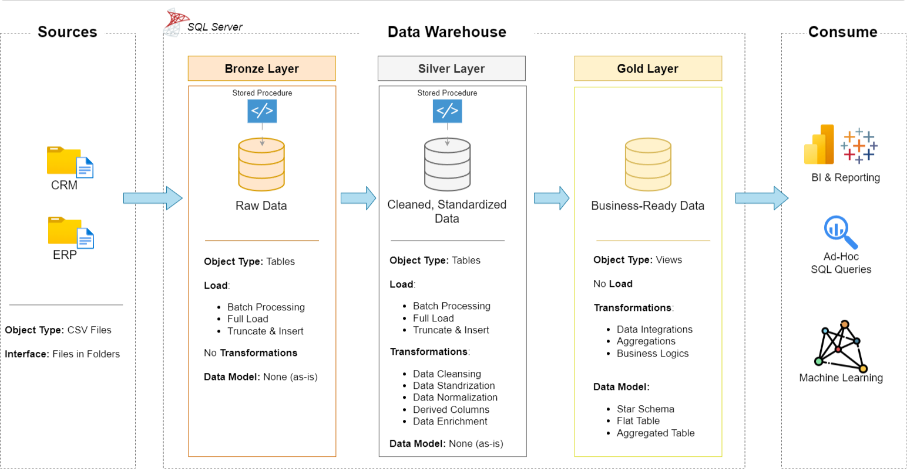

# MSSQL-Medallion-Architecture-Data-Warehouse
This project demonstrates a robust, end-to-end data warehousing solution implemented entirely within Microsoft SQL Server. It showcases the Medallion Architecture (Bronze, Silver, and Gold layers) to transform raw data into high-quality, analytics-ready assets.
**[Chalange found at DataWithBaraa GitHub](https://www.microsoft.com/en-us/sql-server/sql-server-downloads):**

## Project Overview
The data architecture for this project follows Medallion Architecture **Bronze**, **Silver**, and **Gold** layers:

1. **Data Architecture**: Designing a Modern Data Warehouse Using Medallion Architecture **Bronze**, **Silver**, and **Gold** layers.
2. **ETL Pipelines**: Extracting, transforming, and loading data from source systems into the warehouse.
3. **Data Modelling**: Developing fact and dimension tables optimised for analytical queries.
4. **Data Integrity**: Industry-standard practices for handling schema enforcement and data quality.
5. **Analytics Ready**: A final Gold layer structured for seamless integration with Power BI or Excel reporting.

### Objective
This project focuses on architecting a unified data platform using SQL Server to centralise sales information from disparate systems. By consolidating ERP and CRM data, the solution provides a "single source of truth" designed to drive strategic business insights and reporting accuracy.

### Technical Specifications
#### Data Ingestion & Integration
- **Multi-Source Consolidation**: Seamlessly ingests and merges transactional data from CSV-based ERP and CRM exports.
- **Unified Schema**: Transforms raw inputs into a streamlined, integrated data model optimised for high-performance analytical querying.

#### Data Governance & Quality
- **Proactive Cleansing**: Implements robust logic to identify and resolve inconsistencies, missing values, and formatting errors during the transformation phase.
- **Current-State Focus**: Optimised for "snapshot" reporting; the architecture prioritises the most recent data cycles to maintain a lightweight and responsive environment.

#### Deliverables
- **Analytics-Ready Model**: A user-centric design that simplifies complex data structures for business stakeholders.
